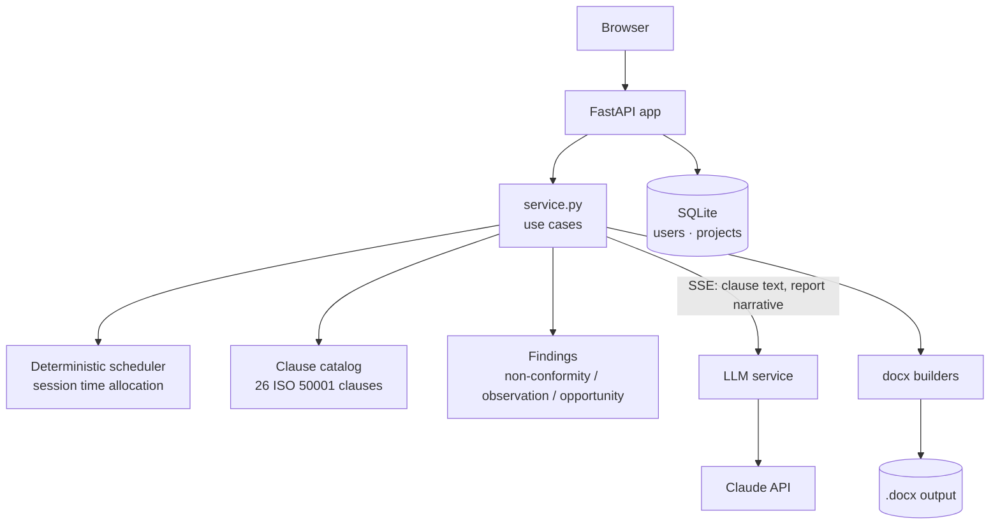

# Audit Report Generator

> End-to-end management of internal ISO 50001 energy-management audits: project setup,
> drag-and-drop scheduling, clause-by-clause execution with AI-assisted drafting, findings
> tracking, and plan/report export to `.docx` using the real corporate templates.

<p align="center">
  
  
  
  
  
</p>

> This is an anonymized, standalone extract of one module from a larger internal platform
> I built at an engineering company. Company-specific references have been removed; the
> architecture, code structure and design decisions are real.

## Problem → Solution → Result

**Problem.** Running an ISO 50001 internal audit end-to-end — scheduling sessions, working
through 26 standard clauses, writing findings, and producing a plan and a final report in the
exact corporate Word format — was a manual, template-juggling process spread across spreadsheets
and Word documents, redone from scratch for every audit.

**Solution.** A single workflow that models the whole audit as one project: automatic session
scheduling from a clause catalog, a clause-by-clause execution screen with AI-assisted drafting
(streamed, not blocking), a findings log that survives regeneration, and a `.docx` exporter that
writes directly into the real template's underlying XML — not just text into placeholders — so
styles, numbering and Word fields (including the table of contents) come out exactly as the
corporate template defines them.

**Result.** The exported document opens in Word with no repair dialog; the audit report, which
used to be assembled by hand from the raw findings, is generated and ready after one review pass.
A missing template produces an explicit `503` instead of a silently corrupted file.

---

## Architecture

Single FastAPI application, no background jobs. `src/shared/` is a small support library
(Anthropic client, token accounting, pricing, migration runner, SSE helpers, OOXML utilities)
shared with the sibling [regulatory-rag-chatbot](https://github.com/cesucede17/regulatory-rag-chatbot)
module, but each tool ships and runs independently — this one doesn't install ChromaDB,
sentence-transformers or LangChain at all, since it does no RAG.



### Key design decisions

| Decision | Why |
|---|---|
| **Direct OOXML writing** | The only way to preserve the corporate templates' styles, numbering and Word fields; `python-docx` alone can't do it |
| **Static JSON clause catalog** | ISO 50001's 26 clauses don't change between audits; modeling them as code would be noise, as DB rows a migration per nuance |
| **Deterministic scheduling** (no LLM) | Session time allocation must be reproducible and auditable, not a model's best guess |
| **"The model proposes, the auditor signs off"** | Manually entered findings are never overwritten when the AI-generated summary is regenerated |
| **No ChromaDB / sentence-transformers / LangChain** | This tool does no retrieval — skipping them keeps startup instant and the environment a fraction of the size |
| **Own SQLite instance, not shared with the chatbot** | Two independent tools behind the same reverse proxy; isolating state lets either be redeployed or reset without risking the other |
| **Pinned dependency versions** | A newer `anthropic` client breaks `langsmith`'s wrapper, and `starlette` ≥1.6 changes how routes are introspected — upgraded deliberately, with the test suite passing |

---

## The 4-step audit wizard

1. **Basics** — project details, sessions, participants, and a **drag-and-drop schedule**:
   reorder blocks, move clauses between blocks, split a block or turn it into a break, with
   live validation for gaps and unassigned clauses.
2. **Audit plan** — review the generated schedule and download `plan.docx`.
3. **Execution** — one card per clause (26 clauses grouped by chapter): auditor notes,
   classification, **streamed AI drafting** (via Server-Sent Events), attachable screenshots
   that can be flagged for inclusion in the generated text, and a findings summary that's
   never lost when the text is regenerated.
4. **Final report** — completeness checklist, AI-generated narrative (strengths,
   recommendations, conclusions), and `report.docx` download.

## `.docx` export

The plan and report builders start from the real reference templates and write directly into
their OOXML, preserving styles, numbering and Word fields — table of contents included. If a
template is missing, the endpoint returns `503` instead of producing a corrupted document.

---

## Stack

Python 3.11+ · FastAPI · python-docx + direct OOXML manipulation (lxml) · Claude API
(Anthropic, streamed via SSE) · SQLite · JWT auth

## Running it

```bash
uv sync
cp .env.example .env     # set ANTHROPIC_API_KEY and the admin passwords
./run.ps1                # or: uv run uvicorn auditorias.main:app --app-dir src --reload --port 8502
# → http://127.0.0.1:8502
```

> The real corporate `.docx` templates are not included (sensitive material, kept out of git in
> the original project). Without them the app still runs; export endpoints return `503` instead
> of a broken file. See [`assets/templates/README.md`](assets/templates/README.md) for the
> expected template structure.

## Authentication & roles

JWT in an httpOnly, `samesite=strict` cookie; bcrypt-hashed passwords; login rate-limited to 5
attempts / 5 min per IP; `admin` role (full access + management panel) vs. standard user (own
projects + shared ones); projects have an owner and collaborators, with collaborators able to
read/write but not manage access or transfer ownership.

## Project structure

```
report-generator/
├── run.ps1
├── pyproject.toml
├── .env.example
├── src/
│   ├── audits/
│   │   ├── main.py                 # FastAPI app
│   │   ├── auth.py
│   │   ├── core/
│   │   │   ├── router.py / router_admin.py
│   │   │   ├── service.py / repository.py / schemas.py
│   │   │   ├── scheduling.py        # Deterministic session scheduling
│   │   │   ├── findings.py          # Findings taxonomy
│   │   │   ├── catalog/             # 26 ISO 50001 clauses + default schedule
│   │   │   ├── docx/                # plan_builder.py / report_builder.py
│   │   │   └── llm/                 # Prompts + streamed LLM service
│   │   ├── templates/ / static/
│   └── shared/                     # Anthropic client, usage tracking, pricing, SSE, OOXML utils
├── assets/templates/                # Reference .docx templates (not in git)
├── data/                            # SQLite + attached screenshots (not in git)
└── tests/
    ├── unit/
    └── integration/
```

## Test coverage note

Export tests need the real `.docx` templates, which aren't in git. A dedicated environment
variable (`REPORTS_REQUIRE_TEMPLATES=1`) turns a missing-template skip into a hard failure — so
CI and any "this covers export" run can't silently pass without actually exercising the
`.docx` builders. Two architectural tests also guard the module boundary: one walks the AST to
make sure no import from the sibling chatbot module (or its heavy dependencies) sneaks in, and
one boots the app in a subprocess and checks ChromaDB/sentence-transformers/torch are never
loaded.

## Security

| Measure | Implementation |
|---|---|
| Auth | JWT httpOnly + `samesite=strict` |
| Passwords | bcrypt (hash + salt) |
| Brute force | 5 attempts / 5 min per IP → 429 |
| CSRF | Single-use token on the login form, 1 h TTL |
| SQL injection | Parameterized queries |
| XSS | Jinja2 autoescaping |
| Path traversal | Filename sanitization on upload |
| Authorization | Per-project owner/collaborator model; `require_admin` on the panel |
| Sensitive material | Corporate `.docx` templates kept out of git |

## Limitations & next steps

- Tied to the ISO 50001:2018 clause set; another standard would need a new catalog and a
  review of the report narrative prompts.
- No template editor — templates are prepared externally and dropped into `assets/templates/`.
- Scheduling is time-block based; it doesn't yet account for auditor availability across
  multiple parallel audits.

## License

MIT — see [LICENSE](LICENSE). Anonymized portfolio extract; not the original production
repository.
